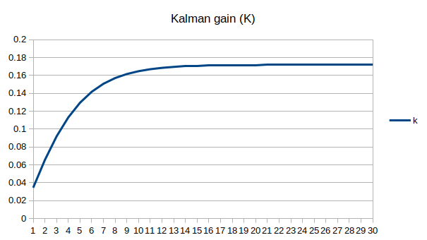

# Kalman
Kalman Filter

## Python implementation (Jupyter notebook)
## Implementation with OpenCV

## Kalman Filter in C
<a href='https://github.com/dalek7/Kalman/tree/master/04_Kalman_in_c/01_SimpleKalman'>Implementation</a> based on based on a work by Adrian Boeing  

  
